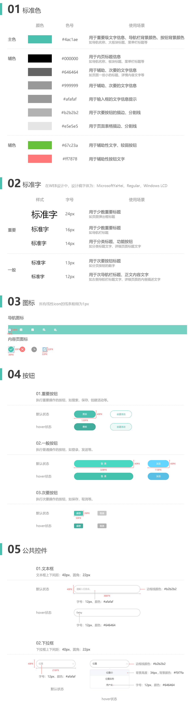

# HTML5/CSS3基础教程

教程官网：http://www.web-jshtml.cn/#/   视频地址：https://space.bilibili.com/431551452

项目访问：[朗朗口腔-学习项目](http://weishen.byethost7.com/langlangdental/)

**学习内容**：原生页面布局、标签语义化；熟练掌握常规属性，CSS3 选择器，定位 position，浮动 float，弹性布局 flex，过渡，圆角，阴影，以及 CSS3 新特性属性等；

**应用学习**：vscode，phpstudy，photoshop，ftp，koala sass 预编辑等；

**学习成效**：读懂布局、公共模块抽离，ajax 数据渲染等；读懂 UI 样式，css 组合、公共样式抽离、sass 语法、雪碧图、页面优化等；

**适用范围**：PC 端、Ipad 端、移动端 web、H5 项目、Hybrid APP 混合开发等等；web 端项目基本通用；

------


# 第1学时

## 1.1 认识 HTML 标签


## 1.2 CSSReset

不同的浏览器对不同的标签有自己内置的样式设置，这是全局性的样式，不同浏览器之间可能设置还不一样，并且内置的样式可能并不是我们想要的，我们就需要重置浏览器默认样式，注意，引用 CSSReset 一般放第一位：

- reset.css - HTML5 标签的重置默认样式，官网地址：https://meyerweb.com/eric/tools/css/reset/
- normalize.css - 比 reset.css 的方案优化了一些，官网地址：http://necolas.github.io/normalize.css/


# 第2学时

## 2.1 公共样式

设计稿中，每个页面都有 "头部"、"底部"、"右侧栏图标"、"面包屑"等等一些其他相同的模块，可以采用一个 "公共样式" 的文件 common.css 来处理。

## 2.2 CSS书写顺序

以盖楼房说明：

1. 位置属性：position、top、right、z-index、display、float （找位置在哪里盖楼房）
2. 尺寸大小：width、height、padding、margin （规定每栋楼的大小）
3. 背景边框：background、border （起水泥柱、上砖、批灰）
4. 文字系列：font、line-height、letter-spacing、color- text-align（房间的装饰、摆个沙发、挂个画什么的）
5. 其他：animation、transition（后期的配套设备）

## 2.3 命名规范


# 第3课时

## 3.1 Git操作

具体详见[「Git 笔记」](https://app.gitbook.com/@sherwinshen/s/front-end-blog/git)。


# 第4课时

## 4.1 项目标准色

项目标准色一般设计师会给出，示例如下，另外，我们可以根据设计稿来设置一些通用的 CSS 样式：




# 第5课时

## 5.1 Sass 预编译

使用 Koala 软件进行自动编译，下载地址：http://koala-app.com/index-zh.html。


# 第6课时

## 6.1 块元素、内联元素

| **块级元素**                                    | **行内元素**                                                 |
| ----------------------------------------------- | ------------------------------------------------------------ |
| 独占一行,默认情况下，其宽度自动填满其父元素宽度 | 相邻的行内元素会排列在同一行里，直到一行排不下，才会换行，其宽度随元素的内容而变化 |
| 可以设置 width/height 属性                      | 行内元素设置 width/height 属性无效                           |
| 可以设置 margin/padding 属性                    | 行内元素起边距作用的只有 margin-left、margin-right、padding-left、padding-right，其它属性不会起边距效果。 |
| 对应于 display: block                           | 对应于 display: inline                                       |


# 第7课时

## 7.1 标签语义化

语义化标签，旨在让标签有自己的含义。说的更直白，就是告诉浏览器我写的这块内容是什么东西。

```html
常见的有：
<title>：页面主体内容。
<hn>：h1~h6，分级标题，<h1> 与 <title> 协调有利于搜索引擎优化。
<ul>：无序列表。
<li>：有序列表。
<header>：页眉通常包括网站标志、主导航、全站链接以及搜索框。
<nav>：标记导航，仅对文档中重要的链接群使用。
<main>：页面主要内容，一个页面只能使用一次。如果是web应用，则包围其主要功能。
<article>：定义外部的内容，其中的内容独立于文档的其余部分。
<section>：定义文档中的节（section、区段）。比如章节、页眉、页脚或文档中的其他部分。
<aside>：定义其所处内容之外的内容。如侧栏、文章的一组链接、广告、友情链接、相关产品列表等。
```

## 7.2 float 的 bug

当“子级”元素使用 float 时，无法撑开“父级”元素高度，后续的布局会越来越乱，因此当“子级”元素使用 float 时，父级一定要清除浮动。

**清除浮动常见解决方法**：

1. 添加新的元素 、应用 clear：both；不好之外：额外增加了一个无意义的标签，有点占用资源
2. 父级上增加属性overflow：hidden；不好之外就在于超出的元素会被隐藏，看不见
3. 定义一个伪类的css样式，把clearfix添加到父元素

## 7.3 页面 logo

一般网页导航栏中的 logo 采用`<h1></h1>`标签来实现。

```html
<h1>
  <a href='' title='' target=''>
    
  </a>
</h1>
```


# 第8课时

## 8.1 列表

- 无序列表 ul、li
- 有序列表 ol、li

## 8.2 a 标签

a 标签的4种状态及设置 CSS:

- a:link 超链接的默认样式 

- a:visited 访问过的（已经看过的）链接样式 

- a:hover 鼠标处于鼠标悬停状态的链接样式 

- a:active 当鼠标左键按下时，被激活（就是鼠标按下去那一瞬间）的链接样式。 

## 8.3 箭头的实现方式

**方法一：background-image**


**背景图片的属性**

- **background-repeat** （背景图重复位置）
  - repeat-x（x轴方向填充）
  - repeat-y（y轴方向填充）
  - no-repeat（不填充）
  
- **background-size** （背景图片的大小）

  - 100% 100% —— x，y轴上完全放大填充，不管图片是否失真
  - cover —— 图片等比例缩放，直到最小部分填满容器
  - contain —— 图片等比例缩放，直到最大部分填满容器

- **background-position** （背景位置坐标，偏移量）

- **background-origin**（背景图片的开始显示位置）

  - border-box：从外边框开始显示
  - padding-box：从内边距开始，默认
  - content-box：从内容处开始

**方法二：对象边框配合css3 配置**


```scss
// 设置左边和下边的边框，然后配合CSS3旋转属性即可得到
i {
  display: inline-block;
  width: 9px;
  height: 9px;
  // 方法二：
  border-bottom: 1px solid $text-gray;
  border-left: 1px solid $text-gray;
  transform: rotate(-45deg);
  @include webkit(box-sizing,border-box)
}
```

方法三：伪元素:before、:after**

```scss
// 不使用i标签，直接在父元素中使用伪元素
.lang{
  &::after {
    content: '';
    display: inline-block;
    height: 6px;
    width: 6px;
    margin: 0 0 4px 0;
    border-bottom: 1px solid $text-gray;
    border-left: 1px solid $text-gray;
    @include webkit(box-sizing, border-box);
    @include webkit(transform, rotate(-45deg));
  }
}
```

## 8.4 SCSS 定义浏览器内核属性

原本CSS3的写法：

```css
-webkit-box-sizing: border-box;
-moz-box-sizing: border-box;
-ms-box-sizing: border-box;
-o-box-sizing: border-box;
box-sizing: border-box;
```

使用SCSS非常简单，且支持各种属性复用：

```scss
@mixin webkit($type,$value){
  -webkit-#{$type}: $value;
  -moz-#{$type}: $value;
  -ms-#{$type}: $value;
  -o-#{$type}: $value;
  #{$type}: $value;
}

// 后续调用-跟函数思想一致传入对应的参数即可
@include webkit(box-sizing,border-box)
```

## 8.5 绝对定位和相对定位

绝对定位：position: absolute;   相对定位：position: relative;

**记住一个重要的概念：绝对定位元素，居于“相对定位” 或 “绝对定位”的元素进行定位**

简单的理解就是：绝对定位元素，需要一个参考对象（父级元素），参考对象的属性是 “相对定位” 或 “绝对定位”

通过设置top、right 、bottom 、left 进行定位，常使用的值为px、%。


# 第9课时

## 9.1 导航栏下拉列表


## 9.2 CSS3 绘制三角形


## 9.3 绝对定位居中


# 第10课时

## 10.1 雪碧图

略。

## 10.2 伪类

应用伪类获取不同的元素，例如：

- `a:first-child` - 获取第一个a元素
- `a:nth-child(n)` - 获取第n个a元素
- `a:last-child` - 获取最后一个a元素


# 第11课时

## 11.1 书籍标签 dl dd dt

> 底部制作使用 dl dd dt书籍标签，举例如下：


```html
<dl>
    <dt>走进朗朗</dt>
    <dd>朗朗简介</dd>
    <dd>朗朗优势</dd>
    <dd>企业荣誉</dd>
    <dd>团队风采</dd>
</dl>
```

## 11.2 行高测量

多行文本测量行高为当前文字的顶部直至下一行文字的顶部。


# 第12课时

## 12.1 transition 过渡

> 推荐的写法：`transition: all 1s linear .5s;`，分别对应下面的四个属性

- transition-property：规定应用过渡的 CSS 属性的名称。
- transition-duration：定义过渡效果花费的时间。默认是 0。
- transition-timing-function：规定过渡效果的时间曲线。
- transition-delay：规定过渡效果何时开始。默认是 0。


可通过网站在线调试：https://cubic-bezier.com/#.17,.67,.83,.67

## 12.2 iconfont

- fontAwesome - http://fontawesome.dashgame.com/
- 阿里巴巴图标库 - https://www.iconfont.cn/ （推荐！！！）


# 第13课时

## 13.1 幻灯片制作


关键点：JS 可以定义一个变量 index 存储当前显示的元素索引，以及获取 clientWidth 宽度来设置显示容器的宽度以及图片元素宽度，并且通过设置 left 来移动图片窗口。

需求：下方的点对应切换；左右箭头对应切换；每隔n秒自动切换；连续点击箭头必须等上一个移动完成才有效；

## 13.2 CSS 改变光标 cursor

详见说明文档：[cursor](https://www.w3school.com.cn/cssref/pr_class_cursor.asp)，常用属性：

- `cursor: pointer` - 光标呈现为指示链接的指针（一只手）。
- `cursor: move` - 此光标指示某对象可被移动。


# 第14课时

## 14.1 figure 标签

如下图所示的布局就适合于figure标签：


```html
<figure>
    <figcaption>标题</figcaption>
    内容区
</figure>
```

## 14.2 animation 动画

推荐的写法：`animation: name 5s infinite;`

- animation-name           规定需要绑定到选择器的 keyframe 名称。。
- animation-duration        规定完成动画所花费的时间，以秒或毫秒计。
- animation-timing-function   规定动画的速度曲线。
- animation-delay           规定在动画开始之前的延迟。
- animation-iteration-count   规定动画应该播放的次数。 n | infinite
- animation-direction        规定是否应该轮流反向播放动画。 normal | alternate

## 14.3 Ajax 请求

```js
$.ajax({
    url: "http://www.hzhuti.com",    //请求的url地址
    dataType: "json",   //返回格式为json
    async: true, //请求是否异步，默认为异步，这也是ajax重要特性
    cache: false, // 是否读取缓存
    data: { "id": "value" },    //参数值
    type: "GET",   //请求方式
    beforeSend: function() {
        //请求前的处理
    },
    success: function(req) {
        //请求成功时处理
    },
    complete: function() {
        //请求完成的处理
    },
    error: function() {
        //请求出错处理
    }
});
```

| 内容                             | 说明                            |
| -------------------------------- | ------------------------------------------------------------ |
| url                              | 必需，规定把请求发送到哪个  URL                           |
| data                             | 可选，映射或字符串值。规定连同请求发送到服务器的数据       |
| success | 可选，请求成功时执行的回调函数                            |
| dataType                         | 可选，规定预期的服务器响应数据类型， 默认执行智能判断（xml、json、script  或 html） |

**返回状态值：**

- 200：成功
- 400：前端提交数据的字段名称或者是字段类型和后台的实体类不一致 或 数据格式不是json对象
- 404：请求地址错误
- 403：跨域问题。开发环境地址 与 请求地址处于不同域
- 500：一般都是服务器内部报错。这种问题跟后台沟通即可


# 第15学时

## 15.1 CSS 权重

| **类型**                     | **权重** | **栗子**                                       |
| ---------------------------- | -------- | ---------------------------------------------- |
| ! important                  | 无穷     |                                                |
| 行间样式                     | 1000     | style                                          |
| id                           | 100      | #id                                            |
| class/属性选择器/伪类/伪元素 | 10       | .class / [type='text'] /  :hover/ ::first-line |
| 标签选择器                   | 1        | div                                            |
| 通配符                       | 0        | *                                              |

## 15.2 sass for 循环

普通css如果我们需要如下的类名则每一个都要具体写：

```
.padding-top-10{padding-top:10px};
.padding-top-20{padding-top:20px};
.padding-top-30{padding-top:30px};
.padding-top-40{padding-top:40px};
.padding-top-50{padding-top:50px};
```

那么基于sass，我们可以利用for循环完成：

```scss
@for $i from 1 through 3 {
  .item-#{$i} {
    width: (20px * $i);
  }
}
```

## 15.3 flex 布局


# 第16课时

## 16.1 swiper 幻灯片插件

[swiper](https://www.swiper.com.cn) 提供各种触摸滑动插件！！！简单配置即可实现大部分所需的滑动功能！！！本案例中用于实现幻灯片！！！


# 第17课时

## 17.1 ajax 请求头类型

- **application/json**（JSON数据格式）："Content-type","application/json; charset=utf-8"

- **application/x-www-form-urlencoded**（默认）："Content-type", "application/x-www-form-urlencoded; charset=utf-8"

- **multipart/form-data**（用于表单含文件时） ："Content-type", "multipart/form-data; charset=utf-8"

- **text/xml**（不常用）："Content-type", "text/xml; charset=utf-8"

## 17.2 图片大小一致

> CSS3 background-size 属性、占位图解决图片大小不一问题

background-size： 

- Contain：图片自身的宽高比例不变，缩放至图片自身能完全显示出来，所以容器会有留白区域；

- Cover：图片宽高比例不变、铺满整个容器的宽高，而图片多出的部分则会被截掉；


```html
<div class='cover-img' style='background-image:url(真实图片)'>
  
</div>

<style>
   .cover-img{
    background-repeat:no-repeat;
    background-position:center; /*居中显示*/
    background-size: cover;
  }
</style>
```

## 17.3 CSS3超出文字省略号

- 单行

```css
text-overflow:ellipsis;
overflow: hidden;
white-space:nowrap;
```

- 多行

```css
display: -webkit-box;
-webkit-line-clamp:2;
-webkit-box-orient: vertical;
overflow: hidden;
```

> 1. -webkit-line-clamp 用来限制在一个块元素显示的文本的行数。
> 2. display: -webkit-box 必须结合的属性 ，将对象作为弹性伸缩盒子模型显示 。 
> 3. -webkit-box-orient 必须结合的属性 ，设置或检索伸缩盒对象的子元素的排列方式 。

## 17.4 免费建站

网址：http://byet.host


# 第18课时

## 18.1 提取共用文件

略

## 18.2 自定义 CSS 分列

```html
<div class="row-container gutter-15 ">
    <div class="row-wrap clearfix">
        <div class="row-item-6">1111</div>
        <div class="row-item-6">1111</div>
    </div>
</div>

<style>
  // 自动分列-类似bootstrap
.row-container {
  overflow: hidden;
  div[class^=row-item] { float: left; box-sizing: border-box; }
  .row-wrap { margin: 0 -15px; }
  &.gutter-15 { div[class^=row-item] { padding: 0 15px; } }
  .row-item-6 { width: 50%; }
  .row-item-3 { width: 33.33%; }
  .row-item-4 { width: 25%; }
}
</style>
```

- 定义分列占比 - row-item-6 / row-item-3 / ...

> 通过使用属性选择器将row-item均浮动`float: left;`，并设置占比` width: 25%;`

- 定义元素间隔 - gutter-15

> 通过padding对row-item设置间隔，注意还需要将row-item改为`border-box`，并对外层嵌套设置`margin: 0 -15px;` 去除左右边界的间隔。

## 18.3 sass继承

> sass继承可使用两种写法，举例如下：

```scss
%child{
  color: white;
}

.parent{
  @extend %child;
}
```

```scss
.child{
  color: white;
}

.parent{
  @extend .child;
}
```

## 18.4 SCSS 组合类

> 通过scss的for循环可以生成一系列的类名，如下所示：

```scss
@for $i from 1 through 10 {
  .padding-top-#{$i*10} {
    padding-top: (10px * $i);
  }
}
```

上述语法即可生成一系列的类名.padding-top-10，.padding-top-20 ......


# 第19课时

## 19.1 CSS 选择器

详见[「CSS 选择器网站」](http://www.web-jshtml.cn/file/selector/)。

举例：实现左右交替的效果即可使用`:nth-child(2n) `选择偶数的对象，`:nth-child(2n-1) `选择奇数的对象，然后分别设置样式。


# 第20课时

暂无。


# 第21课时

## 21.1 form表单

详见[「学习网站」](https://www.w3school.com.cn/html/html_forms.asp)

## 21.2 表单验证

注意点：利用函数时，如果表单验证不通过则需要设置`return: false;`避免继续进行下面的验证

```js
// 举例：
function checkForm() {
    let mobile = document.getElementById('mobile')
    
    if (!mobile.value.value) {
        alert('手机号码不能为空')
        return false // 不再进行后续操作
    }
    if (!(/^1[3456789]\d{9}$/.test(mobile.value))) {
        alert("手机号码有误，请重填");
        return false;
    }

    // 后续为ajax操作
}
```

## 21.3 事件绑定

方法1: 标签内嵌

```js
// <button onclick='click()'></button>
function click(){}
```

方法2: 获取 DOM 对象，传统绑定 - 优先级最高

```js
let button = document.getElementById('button');
button.onclick = function click(){} // 无效，会被下面语句覆盖
button.onclick = function click(){}
```

方法3: 获取 DOM 对象，事件注册

```js
let button = document.getElementById('button');
button.addEventListener('click', function(){}) // 与下方语句均执行
button.addEventListener('click', function(){}) 
```

注意1：事件绑定存在覆盖，而事件注册不会覆盖，都会执行。

注意2：当存在对象较多或者动态生成的时候，不建议采用事件绑定的方式，比较耗内存（比如换页，需要清除事件绑定，不然一直都在内存中），可以使用事件注册，并且视情况采用事件代理方法。


# 第22课时

## 22.1 分享按钮

详见网站[「bshare」](http://www.bshare.cn)，提供多种分享按钮代码！

## 22.2 hgroup标签

当出现多个标题的时候（例如文章的主标题和副标题等），需要采用`<hgroup>`标签来实现。

```html
<hgroup>
    <h1>主标题</h1>
    <h2>副标题</h2>
    <span>来源：朗朗口腔</span>
    <span>日期：2017年9月16日</span>
</hgroup>
```


------

如果发现本项目有错误，欢迎提交 issues 指正。